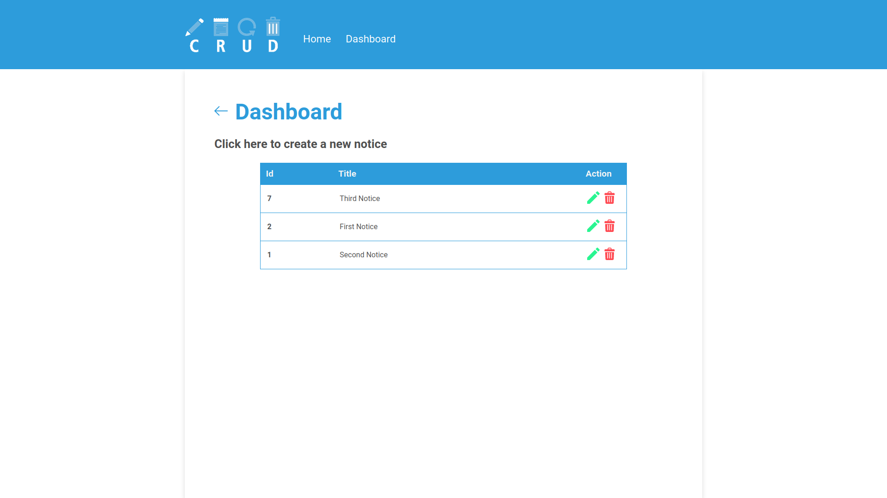

<h1 align="center">Notice Dashboard CRUD</h1>

> A notice dashboard with the four basic operations of a database: Create, Read, Update and Delete (CRUD).

<p align="center">
    
    
    
</p> 

## 🎥 Demo
<div align="center">
     
</div>

<div align="center">
     
</div>

<div align="center">
     
</div>

<div align="center">
     
</div>

<div align="center">
     
</div>

## 🚀 Technologies
* ✔️ HTML
* ✔️ CSS 
* ✔️ PHP
* ✔️ MySQL

## ℹ️ How To Use
### 1. Getting Started
To modify (locally) this project, you will need [PHP](https://www.php.net/downloads.php) and [MySQL](https://www.mysql.com/downloads/) installed on your computer.

### 2. Configuring Your Database
With these tools in hand, it is necessary to create a database. To do this, follow the steps below:
```sh
# Open your MySQL
$ mysql -u root -p

# Create a database
mysql> CREATE DATABASE name_of_database DEFAULT CHARACTER SET utf8 DEFAULT COLLATE utf8_general_ci;

# Change to created database
mysql> USE name_of_database

# Create comments table
mysql> CREATE TABLE IF NOT EXISTS comments (
    id INT NOT NULL AUTO_INCREMENT,
    msg TEXT NOT NULL,
    id_notice INT NOT NULL,
    PRIMARY KEY (id)
) DEFAULT CHARSET = utf8;

# Create notices table
mysql> CREATE TABLE IF NOT EXISTS notices (
    id INT NOT NULL AUTO_INCREMENT,
    title VARCHAR(30) NOT NULL,
    description TEXT NOT NULL,
    PRIMARY KEY (id)
) DEFAULT CHARSET = utf8;
```

After this, you will need to connect the database by changing the data in [Env.php](https://github.com/vitormrts/notice-dashboard-crud/blob/master/app/config/Env.php).

### 3. Cloning And Running The Project

```sh
# Clone this repository in a location where the local server can run it.
$ git clone https://github.com/vitormrts/notice-dashboard-crud

# Go to the repository cloned
$ cd notice-dashboard-crud
```

Done! Now you can open the app.

## 🤝 Contributing

To contributing to this project, follow the steps bellow.

1. Fork the Project;
2. Create your Feature Branch (`git checkout -b new-branch`)
3. Commit your Changes (`git commit -m 'DESCRIPTION OF CHANGES'`)
4. Push to the Branch (`git push origin new-branch`)
5. Open a Pull Request

## 📝 License
This project is under the MIT license. See the [LICENSE](https://github.com/vitormrts/notice-dashboard-crud/blob/master/LICENSE) file for more details.

---

<p align="center">Made with ❤️ by <strong>Vitor Martins ✌ </p>


